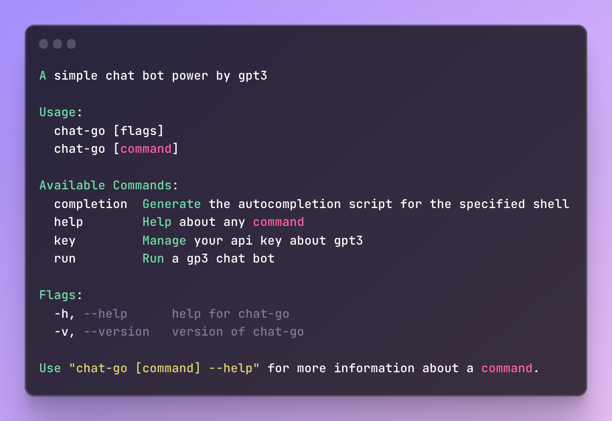
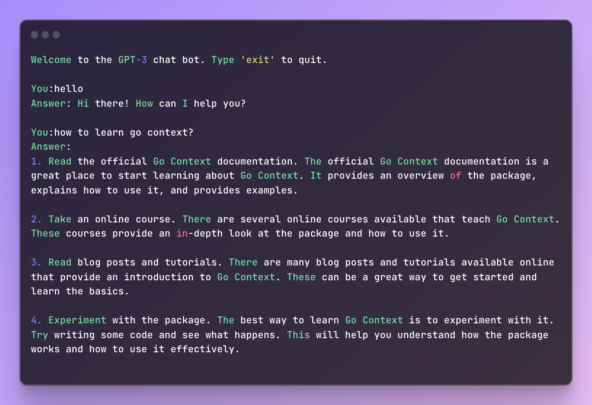

  

    CLI ChatBot Power By <b>Gpt3</b><em>(speed)</em> 

## Features

- 🐤 Gpt3 ChatBot
- 🍉 Store Keyring
- 🥑 Cobra CLI

## Snapshot

  

## More Info

- [Go Keyring library](https://github.com/zalando/go-keyring)

- [Cobra CLI library](https://github.com/spf13/cobra-cli/blob/main/README.md)

- [golang常见库cobra](https://segmentfault.com/a/1190000023382214)

- [chatGpt3](https://github.com/PullRequestInc/go-gpt3)
